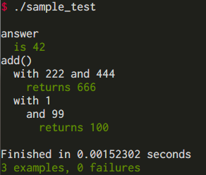

# SpecC

SpecC: RSpec like lightweight test framework for C99

## Features

* RSpec like syntax (`describe`, `context` and `it`)
* Pending test with message
* pre/post-processing of test via `before`/`after`
* Catch and report a signal such as SIGSEGV
* Colored output

Most features are inspired by the [RSpec](http://rspec.info/).

## Install

```bash
$ git clone https://github.com/autopp/specc.git
$ cd specc
$ make      # Create libspecc.so
$ export LD_LIBRARY_PATH=${LD_LIBRARY_PATH}:$(pwd)
$ make test # Run examples
```

When build success, `libspecc.so` should be created.

SpecC is Tested at Ubuntu 14.04 with GCC 4.8.4.
The code using SpecC requires GCC because some features depend on The GCC extensions that NOT supported other compilers.

## Usage

### Writing

```c
#include <specc.h>

int answer = 42;

int add(int x, int y) {
  return x + y;
}

/**
 * This test code contains 3 examples, and all should success.
 */
specc {
  describe ("answer") {
    it ("is 42") {
      expect_that(answer == 42);
    }
  }

  describe ("add()") {
    context ("with 222 and 444") {
      it ("returns 666") {
        expect_that(add(222, 444) == 666);
      }
    }

    context ("with 1") {
      context ("and 99") {
        it ("returns 100") {
          expect_that(add(1, 99) == 100);
        }
      }
    }
  }
}
```

There are some examples in `example/`.

### Executing

```bash
$ cc -I/path/to/specc -L/path/to/specc --std=gnu99 sample_test.c -o sample_test -lspecc
$ ./sample_test
```

You should get output below:



## More Examples

### Failed Test

When a test code is bellow:

```c
#include <specc.h>
#include <stdio.h>
#include <string.h>

int add(int x, int y) {
  return x + y;
}

// There are incomplete functions
int fact(int n) {
  if (n > 0) {
    return fact(n - 1) * n;
  } else {
    // This is BUG!
    return 0;
  }
}

char *copy_hello(char *s) {
  s = NULL; // This is BUG
  sprintf(s, "hello world");
  return s;
}

/**
 * This test code contains 2 examples and all should fail
 */
specc {
  describe ("fact()") {
    context ("with 5") {
      it ("returns 120") {
        expect_that(fact(5) == 120);
      }
    }
  }

  describe ("copy_hello()") {
    it ("returns \"hello world\"") {
      char s[20];
      expect_that(strcmp(copy_hello(s), "hello world") == 0);
    }
  }

  describe ("add()") {
    context ("with 40 and 2") {
      it ("returns 42") {
        // Pending example that should success
        pending("not implemeted");
        expect_that(add(40, 2) == 42);
      }
    }
  }
}
```

You get a output bellow:


Note that SpecC handles SIGSEGV in the second example.
Currently, SpecC can handle the following signals:

* SIGSEGV
* SIGPIPE
* SIGFPE

### Pending

When a test code is bellow:

```c
#include <specc.h>
#include <stdio.h>
#include <string.h>

int add(int x, int y) {
  return x + y;
}

// There are incomplete functions
int fact(int n) {
  // fake implemetation
  return -1;
}

char *copy_hello(char *s) {
  s = NULL; // This is BUG
  sprintf(s, "hello world");
  return s;
}

// This test code contains 3 examples and 2 pending, 1 success
specc {
  describe ("fact()") {
    context ("with 5") {
      it ("returns 120") {
        pending("not implemeted");
        expect_that(fact(5) == 120);
      }
    }
  }

  describe ("copy_hello()") {
    it ("returns \"hello world\"") {
      char s[20];
      pending("now debugging");
      expect_that(strcmp(copy_hello(s), "hello world") == 0);
    }
  }

  describe ("add()") {
    context ("with 40 and 2") {
      it ("returns 42") {
        expect_that(add(40, 2) == 42);
      }
    }
  }
}
```

You get a output bellow:


Note that failed pending example do not affect exit status.

### `before`/`after`

When a test code is bellow:

```c
#include <specc.h>

typedef struct {
  const char *name;
  int age;
} *Person;

Person new_person(const char *name, int age) {
  Person p = malloc(sizeof(Person));

  p->name = name;
  p->age = age;

  return p;
}

#define get_person_name(p) ((p)->name)

#define get_person_age(p) ((p)->age)

void delete_person(Person p) {
  free(p);
}

specc {
  describe ("Person") {
    context ("with \"Jhon\" and 42") {
      Person person;

      before {
        // This code is executed before each `it'
        person = new_person("Jhon", 42);
      }

      after {
        // This code is executed after each `it'
        delete_person(person);
      }

      describe ("get_person_name()") {
        it ("returns \"Jhon\"") {
          expect_that(strcmp(get_person_name(person), "Jhon") == 0);
        }
      }

      describe ("get_person_age()") {
        it ("returns 42") {
          expect_that(get_person_age(person) == 42);
        }
      }
    }
  }
}
```

`before`/`after`'s code are executed before/after each `it`.
You get a output bellow:


There are several limitations to `before`/`after`.

  * In a same `describe` scope, `before`/`after` blocks should be placed above the `it`.

Multiple `before`/`after` is allowed in both same and nested scope.
(See [`example/before_after_nested.c`](example/before_after_nested.c) and [`example/multiple_before_after.c`](example/multiple_before_after.c))

## TODO
* More assert functions.
* Show failure position in example.
* Command line options for handling the behavior of SpecC.
* RSpec's `before(:all)`/`after(:all)`

## Links
* [RSpec](http://rspec.info/): Inspired most syntaxs and features.
* [Cello](http://libcello.org/): Many of the implementation technique was here in reference.

## Author
[@AuToPP](https://twitter.com/AuToPP)

## License
[MIT](LICENSE.txt)
